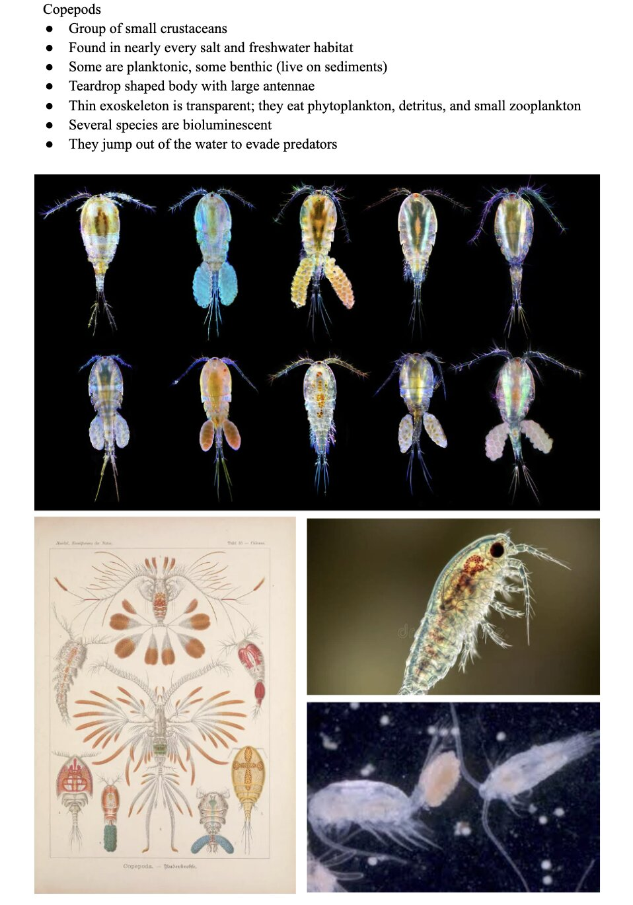
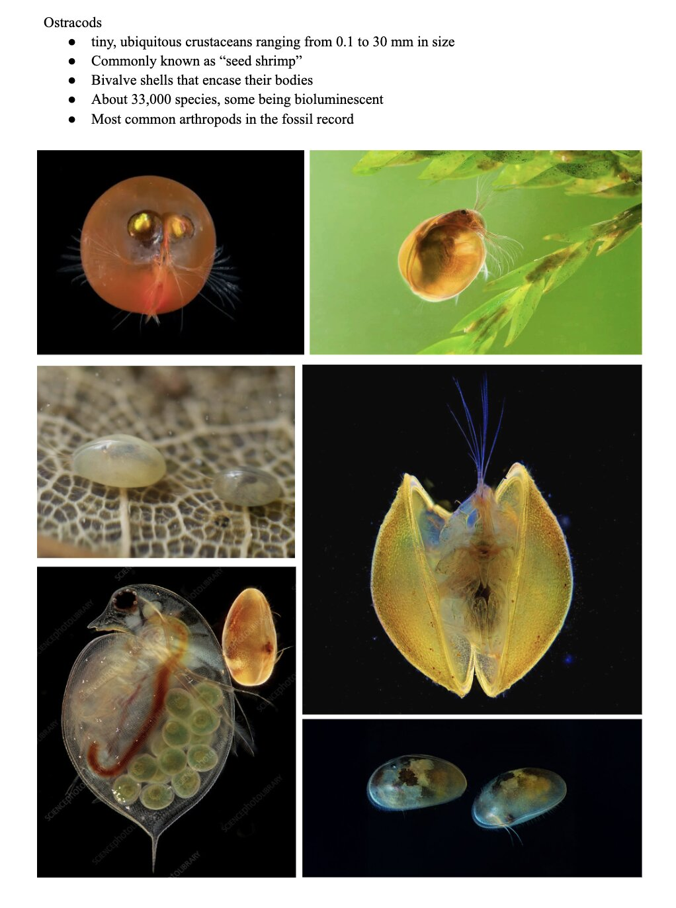
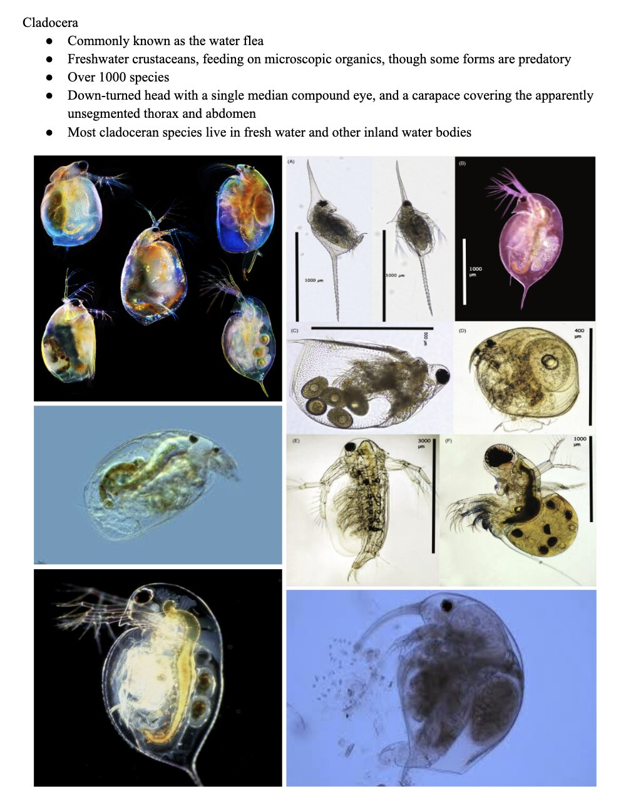

# Ideas of Analysis

-   **Main question: What is the relationship between the abundance of aquatic invertebrates and water temperature in NCOS?**

-   

    1.  What is the spread of the average abundance of the top three dominant taxa?

-   

    2.  How does the average abundance of the top three dominant taxa vary across water temperature ranges?

-   

    3.  Does the average abundance of the top most dominant taxa vary across seasons? -\> Do the top three dominant taxa have different ideal temperatures that affect abundance, or do they all thrive at the same temperature?

***Exploratory***

-   

    4.  What is another way we can visualize the distribution of abundance of the three dominant taxa?

-   

    5.  How does average abundance of top three taxa vary across sites?

-   

    6.  How does average abundance vary across NCOS site for each taxon?

The coding that explores these relationships is listed below during the creation of the visualizations.

# Background

-   From 1966 to 2013, the space where NCOS sits was used as a 9-hole golf course. After a couple years of extensive planning, the NCOS restoration project began in February 2017, managed by the UCSB Cheadle Center. This space has created more than 40 acres of estuarine and palustrine wetlands and restored more than 60 acres of upland habitats. In comparison with COPR, the study has found that NCOS appears to have equivalent, if not slightly greater species richness and evenness.

-   The study of comparing the aquatic macroinvertebrate species diversity and abundance of the newly restored wetlands at NCOS began in the spring of 2018. The goal of the study was to collect samples of taxa and water quality at all 12 Deverux Slough sites using pH and YSI meters, as well as 250 μm filtered beakers (FB250) and eDNA (Environmental DNA). More specifically, the invertebrate samples are collected by student interns and volunteers using a filtered bucket and dip net method, with the 3 most common invertebrates found with the filtered beaker 250 micron method being copepods, cladocera, ostracods. At the CCBER Roost Lab, the FB250 samples were inspected under a microscope and sorted by invertebrate taxa by interns. The E-DNA samples are lastly sent to an external lab to be further inspected. Our research question is relevant to NCOS because aquatic invertebrates are ecological bioindicators that are often used to measure water quality. According to NCOS researchers Grinstead, Huitema, Norman, et al., “this study aims to reveal the comparative difference in macroinvertebrate species diversity and abundance over time as conservation continues to increase through the NCOS wetlands, particularly using it as a model to prompt conservation efforts in other locations. The results of this exp
\eriment serve as a foundation for future discovery of how water quality can be a great indicator of the state of a wetland.” [@devereux2022]

-   Our research question reaches outside of NCOS, building on how aquatic invertebrates are not just indicators at NCOS, but all wetlands. According to Ecological Indicators, due to their short life spans and vulnerability to ecological stressors, aquatic invertebrates are widely used to measure the health of wetlands and aquatic ecosystems. Each are meaningful in their own ways as processors of organic material and prey for larger species [@dehingia2026]. They all sit at the bottom of the food chain and bridge the gap between primary producers and larger predators like fish and waterbirds by being an easy food source for larger predators [@kwok2015]. Copepods are especially important in transferring energy to higher trophic levels, cladocera are primarily filter feeders, and ostracods serve as strong bioindicators of environmental conditions [@dehingia2026].

-    Temperature is one strong abiotic driver of the physical processes in aquatic ecosystems and wetlands, which can be assessed using the abundance of aquatic invertebrates. Each species requires a specific temperature range for optimal performance; when approaching their thermal limits, organisms show signs of stress, resulting in changes in behaviour resulting in migration or death [@bonacina2022]. Each of the taxa have specific ideal temperature ranges and generally disappear at more extreme temperatures, with all ideal temperatures being around a range of 18-30℃ ([@li2009],[@bonacina2022]).  When the invertebrates function at their ideal temperature, it leads to an overall healthier aquatic ecosystem.

# Visualizations

## Packages

```{r}
#| label: packages
#| message: false
#| warning: false

# general use and cleaning
library(tidyverse)
library(here)
library(janitor)
library(snakecase)

# wrapping axis labels
library(scales)

# reading in .xlsx files
library(readxl)

# arranging plots
library(patchwork)
library(ggridges)

```

## Data

```{r}
#| label: data
#| message: false
#| warning: false

# taxonomic information
taxon_list <- read_csv(here("data", "taxon_list.csv")) 

# aquatic invertebrates
aq_ins <- read_xlsx(here("data", "Aquatic Sampling Data-2026-03-10.xlsx"),
                    sheet = "Aquatic Insects") 

# site information
sites <- read_xlsx(here("data", "Aquatic Sampling Data-2026-03-10.xlsx"),
                   sheet = "sites")

# water quality information
water_quality <- read_xlsx(here("data", "Aquatic Sampling Data-2026-03-10.xlsx"),
                           sheet = "Water Quality",
                           na = c("", "n/a", "N/A", "over", "173+")) 
```

## Cleaning and Wrangling

### `sites` object

```{r}
#| label: ncos-site-object
#| message: false

# creating new object from sites
ncos_sites <- sites |> 
  # filter to only include NCOS sites sampled four times a year
  filter(sector == "NCOS" & sampling_frequency == "Quarterly")
```

### `taxon_list` object

```{r}
#| label: cleaning-taxon-list
#| message: false

# creating new clean object from taxon_list
taxon_list_clean <- taxon_list |> 
  # converting taxon name to snake case (no spaces or capital letters,
  # only underscores)
  mutate(verbatim_name = to_any_case(verbatim_name, case = "snake")) |> 
  select(verbatim_name, scientificName)
```

### `water_quality` object

```{r}
#| label: water-quality-cleaning
#| message: false

water_quality_clean <- water_quality |> 
  
  # cleaning column names
  clean_names() |> 
  
   # filtering join: only include sites in ncos_sites
  # keep all the rows on the left that match up with rows on the right
  semi_join(ncos_sites, by = "site") |> 
  
  # combine date and site together and remove those indiv. columns
  unite("date_site", date, site, remove = TRUE) |> 
  
  # combine date and site together and remove those indiv. columns
  group_by(date_site) |> 
  
  # create new columns that show median of each variable at each date_site
  # because there are multiple samples at the same site at different depths
  summarize(med_ph    = median(p_h, na.rm = TRUE),
            med_sal   = median(salinity_ppt, na.rm = TRUE),
            med_do    = median(dissolved_oxygen_mg_l, na.rm = TRUE),
            med_temp  = median(temperature_c, na.rm = TRUE)) |>
  
  # ungroup
  ungroup() |> 
  
  # take out outlier
  filter(date_site != "2022-08-12_NVBR")

```

### `aq_ins` object

```{r}
#| label: cleaning-aq-ins
#| message: false
#| warning: false

# creating new clean object from aquatic inverts
aq_ins_clean <- aq_ins |> 
  # clean column names
  clean_names() |> 
  # filtering join: only include sites occurring in ncos_sites
  semi_join(ncos_sites, by = c("site")) |> 
  # renaming columns
  rename(date = date_on_vial) |> 
  # select columns of interest
  select(date, sample_type, site,
         ostracod,
         copepod,
         cladocera) |> 
  # filter to only include "filtered beaker" samples
  filter(sample_type %in% c("FB 250", "FB250")) |> 
  # convert the data frame to long format
  pivot_longer(cols = ostracod:cladocera,
               names_to = "taxon",
               values_to = "abundance") |> 
  # group by date, site, taxon
  group_by(date, site, taxon) |> 
  # calculate average abundance per liter (sum abundance divided by 7.5 liters)
  summarize(ave_lit = sum(abundance, na.rm = TRUE)/7.5) |>
  # remove zero abundance rows
  filter(ave_lit > 0) |>
  # ungroup data frame
  ungroup() |> 
  # create a new column called `date_site` to join with water quality
  unite("date_site", date, site, remove = FALSE) |> 
  # join with water quality
  left_join(water_quality_clean, by = c("date_site")) |> 
  # join with taxon list
  left_join(taxon_list_clean, by = c("taxon" = "verbatim_name")) |> 
  # add full names of sites
  mutate(site_full = case_when(
    site == "NVBR" ~ "North of Venoco Bridge",
    site == "NEC" ~ "South of Venoco Bridge",
    site == "NMC" ~ "Main Channel",
    site == "NPB" ~ "South of Phelps Bridge",
    site == "NPB1" ~ "North of Phelps Bridge",
    site == "NPB2" ~ "Phelps Road",
    site == "NWP" ~  "West Pond",
    site == "NDC" ~ "Devereux Creek"
  )) |> 
  # setting factor levels for site
  mutate(site_full = fct_reorder(site_full, med_sal, .fun = "median", .na_rm = TRUE),
         site_full = fct_rev(site_full)) |> 
  
  # log+1 transform of average abundance per liter
  mutate(log_ave_lit = log(ave_lit + 1)) |>                        # <-- Fig 1, 2, 3, 4
  
  # season derived from date
  mutate(season = case_when(
    month(date) %in% c(3, 4, 5)  ~ "Spring",
    month(date) %in% c(6, 7, 8)  ~ "Summer",
    month(date) %in% c(9, 10, 11) ~ "Fall",
    month(date) %in% c(12, 1, 2) ~ "Winter"
  ),
  season = factor(season, levels = c("Spring", "Summer", "Fall", "Winter"))) |># <-- Fig 4
  mutate(taxon = factor(taxon, levels = c("copepod", "ostracod", "cladocera")))

# capitalizing invertebrate names
aq_ins_clean$taxon <- str_to_sentence(aq_ins_clean$taxon)
  

```

### Setting plot aesthetics

```{r}
#| label: plot-aesthetics
#| message: false
#| warning: false

# colors for taxa
taxon_cols <- c(
  "Ostracod" = "orange2",
  "Copepod" = "tomato3",
  "Cladocera" = "turquoise4")

sites_cols <- c(
  "NDC" = "hotpink3",
  "NEC" = "cyan3",
  "NMC" = "lightpink2",
  "NPB" = "slateblue3",
  "NPB1" = "steelblue3",
  "NPB2" = "green3",
  "NVBR" = "maroon3"
  
)

# setting common theme elements
theme_set(
  theme_classic() +
    theme(text = element_text(size = 12),
          plot.title.position = "plot",
          legend.position = "none"))

```

# Main Visualizations

## Figure 1 - What is the average abundance distribution of the three dominant taxa?

```{r}
#| label: strip-chart
#| message: false
#| warning: false
#| fig-height: 5 
#| fig-width: 8

# base layer: create new object to store figure 1
figure1 <- ggplot(data = aq_ins_clean,
                 aes(x = taxon,
                     y = log_ave_lit,
                     color = taxon)) +
  
  # first layer: jitter plot
  geom_jitter(height = 0,
              alpha = 1,
              width = 0.2,
              shape = 21) +
  
  # second layer: points to represent medians
  stat_summary(geom = "point",
               fun = "mean",
               size = 4,
               color = "black",
               shape = 18) + # 18 = filled diamond 
  
   stat_summary(geom = "errorbar",
               fun.data = mean_se,
               width = 0.1,
               color = "black") +
  
  # colors 
  scale_color_manual(values = taxon_cols) +
  
  # titles
  labs(x = "Taxon",
       y = "log + 1 transformed average abundance/L",
       title = "Figure 1:

Mean and Distribution of Average Abundance for Three Dominant Taxa")

figure1

```

## Figure 2 - How does abundance vary across temperature ranges for each taxon?

```{r}
#| label: fig2-abundance-by-temperature-ranges
#| fig-height: 6
#| fig-width: 10

# revised timeline: mutating aq ins clean to account for ranges, copied from Claude 
aq_ins_clean <- aq_ins_clean |>
  mutate(temp_range = cut(med_temp,
                          breaks = c(10.0, 15.6, 21.2, 26.8, 32.4, 38.0),
                          labels = c("10.0-15.6C", "15.6-21.2C", "21.2-26.8C", 
                                     "26.8-32.4C", "32.4-38.0C"),
                          include.lowest = TRUE),
         point_color = if_else(log_ave_lit == 0, "Zero Abundance", as.character(temp_range)),
         point_color = factor(point_color, levels = c("10.0-15.6C", "15.6-21.2C", 
                                                       "21.2-26.8C", "26.8-32.4C", 
                                                       "32.4-38.0C", "Zero Abundance")))


# base layer: create new object to store figure 2
figure2 <- ggplot(data = aq_ins_clean,
                   mapping = aes(x = med_temp,
                                 y = log_ave_lit,
                                 color = temp_range)) +
  # first layer: points
  geom_point() + 

  # facet by taxon
  facet_wrap(~taxon,
             scales = "free") +
  
  # add legend
  theme(legend.position = "right")+
  
  # labels
  labs(title = "Figure 2:

Average Abundance and Average Water Temperature for Three Dominant Taxa",
       x = "Average Temperature (ºC)",
       y = "log + 1 Transformed Average Abundance/L",
color = "Temperature Range") +
  
  # setting ranges 
  scale_x_continuous(
    breaks = c(10.0, 15.6, 21.2, 26.8, 32.4, 38.0),
    limits = c(10.0, 38.0)) +

  # manually setting colors
  scale_color_manual(values = c(
    "10.0-15.6C" = "steelblue",
    "15.6-21.2C" = "skyblue",
    "21.2-26.8C" = "gold",
    "26.8-32.4C" = "orange",
    "32.4-38.0C" = "tomato3",
    "Zero Abundance" = "black"
  ), na.value = "grey50")
  
  
figure2


```

## Figure 3 - What is the strength of the relationship between average water temperature and average invertebrate abundance across by season?

```{r}
#| label: fig3-exploratory-season-graph
#| fig-height: 5 
#| fig-width: 8

# base layer: create new object to store figure 4
figure3 <- ggplot(data = aq_ins_clean,
                   mapping = aes(x = med_temp,
                                 y = log_ave_lit,
                                 color = taxon)) +
  # first layer: points
  geom_point() + 

  # facet by season
  facet_wrap(~season,
             axes = "all") +
  
  # titles and labels
  labs(title = "Figure 3:

Average Abundance and Average Water Temperature by Season for Three Dominant Taxa",
       x = "Average Temperature (ºC)",
       y = "log + 1 Transformed Average Abundance/L",
       color = "Taxon") +
  
  # manual colors
  scale_color_manual(values = taxon_cols) +
  
  # legend
  theme(legend.position = "right")


figure3

```

# Other exploratory visualizations

## Figure 4 - How is abundance distributed across the three dominant taxa?

```{r}
#| label: fig4-exploratory-ridgeline-plot
#| fig-height: 5
#| fig-width: 8

# creating new object for ridgeline
figure4 <- ggplot(data = aq_ins_clean,
                 # x-axis: avg temp
                 # y-axis: avg abund
                 # fill geometries by site
                 mapping = aes(x = log_ave_lit,
                               y = taxon,
                               fill = taxon)) +
  # ridges (scale makes ridges shorter so that they don't overlap)
  geom_density_ridges(scale = 0.8) +
  
  # adding means and 95% confidence intervals
  stat_summary(geom = "pointrange",
               fun.data = mean_cl_normal,
               size = 0.75,
               linewidth = 1) +
  # filling geometries with color
  scale_fill_manual(values = taxon_cols) +
  # setting y-axis expansions
  scale_y_discrete(expand = expansion(mult = c(0.01, 0.15))) +
  # relabelling x- and y-axis
labs(title = "Figure 4:

Ridge Figure Average Abundance for Three Dominant Taxa",
       y = "Taxon",
       x = "log + 1 Transformed Average Abundance/L") 

# displaying object
figure4
```

## Figure 5 - How does abundance vary across sites for each taxon?

```{r}
#| label: fig5-exploratory-abundance-by-site
#| fig-height: 6
#| fig-width: 12


# base layer: create new object to store figure 5
figure5 <- ggplot(data = aq_ins_clean,
                   mapping = aes(x = site,
                                 y = log_ave_lit,
                                 color = site)) +
  
  # first layer: points
  geom_point() + 

  # facet by taxon
  facet_wrap(~taxon) +
  
  # add legend
  theme(legend.position = "right") +
  
  # manual colors
  scale_color_manual(values = sites_cols) +
  
  # labels and title
  labs(title = "Figure 5:

Average Abundance by Site for Three Dominant Taxa",
       x = "Site",
       y = "log + 1 Transformed Average Abundance/L",
       color = "Site") 
  
  
figure5


```

## Figure 6: What is the relationship between aquatic invertebrates and temperature across site?

```{r}
#| label: fig6-exploring-by-site
#| message: false
#| warning: false
#| fig-height: 6
#| fig-width: 8

# base layer: create new object to store figure 6
figure6 <- ggplot(data = aq_ins_clean,
                  mapping = aes(x = med_temp,
                                y = log_ave_lit,
                                color = taxon)) +
  # first layer: points
  geom_point() + 
  
  # facet by site
  facet_wrap(~site_full,
             axes ="all") +
  
  # labels 
  labs(title = "Figure 6:

Dominant Three Taxa Abundance and Average Water Temperature by Site",
       x = "Average Temperature (ºC)",
       y = "log + 1 Transformed Average Abundance/L",
       color = "Taxon") +

  # manual colors
  scale_color_manual(values = taxon_cols) +
  
  # adding legend
  theme(legend.position = "right")
  
  

figure6

```

## Timeline and Plan for elective

**Timeline**

Week 7:

-   Research all three organisms (copepod, ostracod, cladoceran)
-   Gather reference images
-   Review your figures
-   Take notes on what each figure shows about the species
-   Brainstorm collage/drawing style and decide on materials (digital vs. physical).

Week 8 (timeline check-in):

-   Have a rough sketch/draft of all three 2D collages– one per organism
-   Bring your notes on what the figures show about each species. This is our plan and draft milestone.

Week 9:

-   Refine and finalize the artwork for 1–2 of the organisms
-   Fill in your species notes with complete observations from your figures.

Week 10:

-   Complete the third organism's artwork and finish all species notes
-   Do a full review, make sure each collage clearly reflects what your figures show about that species.

Finals week:

-   Final polish, compile everything together
-   Present your completed 2D collage triptych with notes.

------------------------------------------------------------------------

**Advanced Elective Visualization Approach and Temperature Color Scale**

For our final visualization, we decided on a physical drawing. Each organism will be represented by an outline, filled with paint and pastels to illustrate the relationship between abundance and temperature. The colors inside each outline correspond to a temperature-based heat range, divided into five equal intervals spanning the full range of recorded temperatures (10.20°C – 37.30°C):

-   \textcolor{coldblue}{10.0°C – 15.6°C}
-   \textcolor{lightblue}{15.6°C – 21.2°C}
-   \textcolor{lightyellow}{21.2°C – 26.8°C}
-   \textcolor{softorange}{26.8°C – 32.4°C}
-   \textcolor{hotred}{32.4°C – 38.0°C}

**Gathering Images and Research on Organisms**

{width="85%"}

{width="85%"}

{width="85%"}

# References

::: {#refs}
:::
 